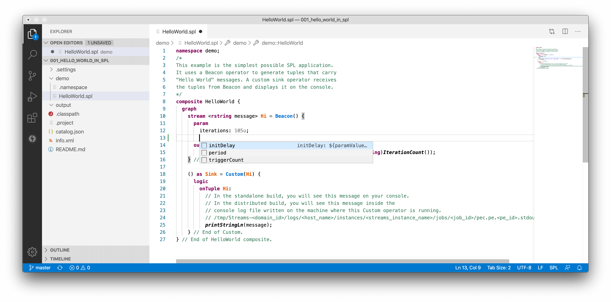
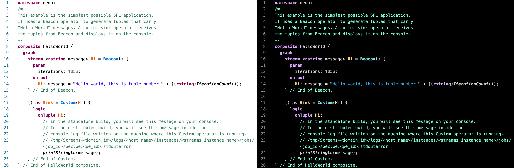
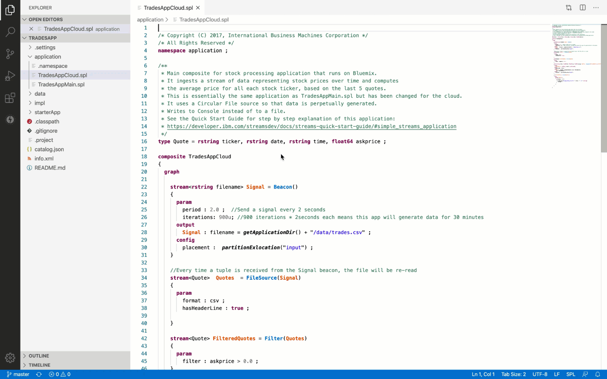
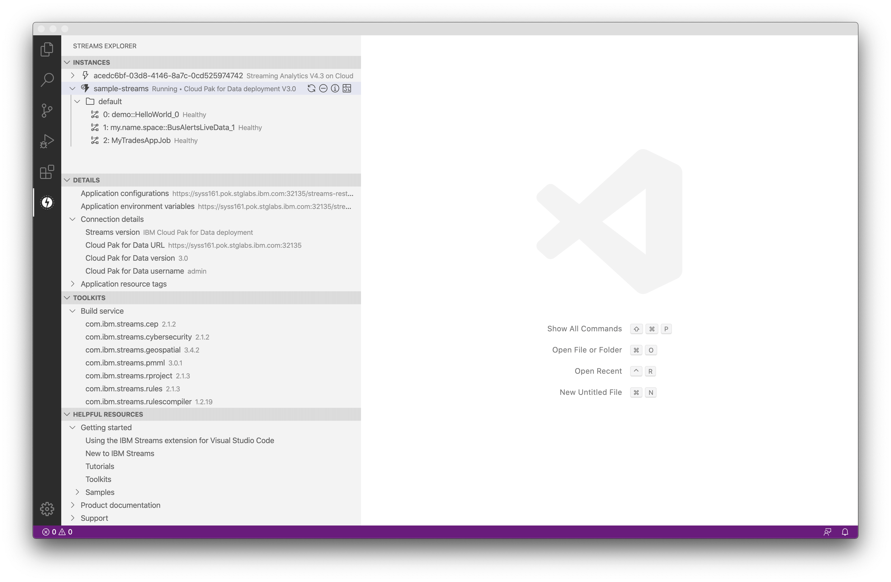
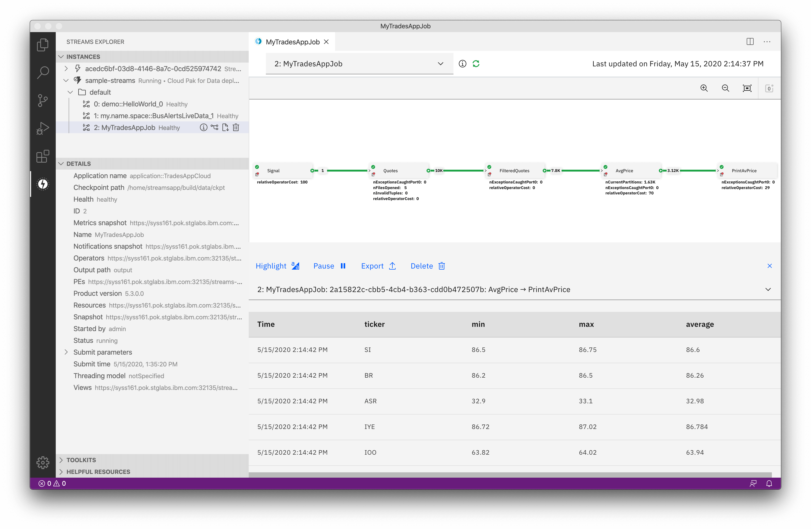
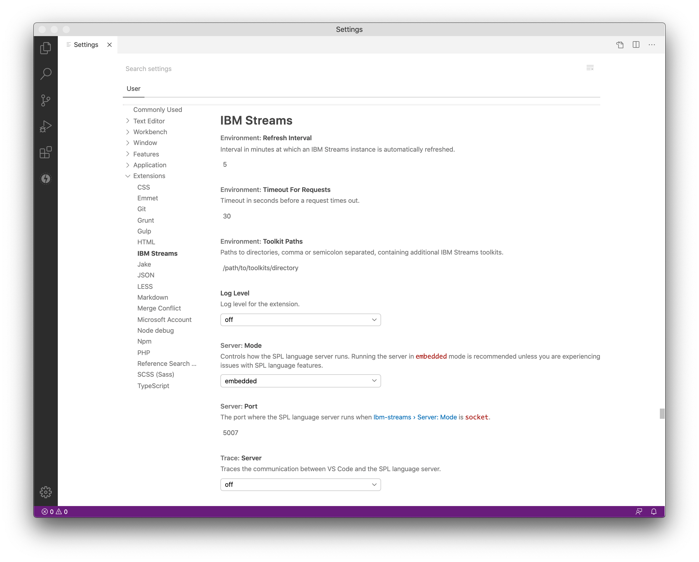
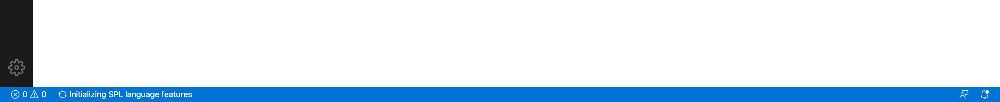

# IBM Streams support for Visual Studio Code

This extension provides support for [IBM Streams](https://www.ibm.com/cloud/streaming-analytics) within the [Visual Studio Code](https://code.visualstudio.com) editor and works with the following Streams versions.

- [__IBM Cloud Pak for Data deployment__](https://www.ibm.com/support/producthub/icpdata/docs/content/SSQNUZ_current/cpd/svc/streams/developing-intro.html): delivers a platform for combining streaming and stored data with AI to build solutions that impact business decisions in real time
- [__IBM Streams standalone deployment__](https://www.ibm.com/support/knowledgecenter/en/SSCRJU_5.2.0/com.ibm.streams.welcome.doc/doc/kc-homepage.html) (on premises): delivers a programming language and IDE for applications, a runtime system and analytic toolkits to speed development
- [__IBM Streaming Analytics on IBM Cloud__](https://cloud.ibm.com/docs/services/StreamingAnalytics?topic=StreamingAnalytics-gettingstarted): offers most of the features of IBM Streams on an agile, cloud-based platform

[Visual Studio Code 1.38.0](https://code.visualstudio.com/updates/v1_38) or later is required.

## Setup instructions

To install the extension, search for __IBM Streams__ in the VS Code [Extension Marketplace](https://marketplace.visualstudio.com/items?itemName=IBM.ibm-streams).

### Add Streams instances

Before you can interact with Streams, you must add one or more Streams instances through the [Streams Explorer](#streams-explorer-view) view. The prerequisites for each of the supported Streams versions are detailed below.

Streams version | Prerequisites
--- | ---
[IBM Cloud Pak for Data deployment](https://www.ibm.com/support/producthub/icpdata/docs/content/SSQNUZ_current/cpd/svc/streams/developing-intro.html) | A provisioned IBM Streams service instance is required. You must provide the following information in order for this extension to connect to your service instance.   <ul><li>IBM Cloud Pak for Data version</li><li>IBM Cloud Pak for Data web client URL</li><li>IBM Cloud Pak for Data credentials</li></ul> If you need to provision a service instance, start [here](https://www.ibm.com/support/producthub/icpdata/docs/content/SSQNUZ_current/cpd/svc/streams/intro.html) and follow the instructions.
[IBM Streams standalone deployment](https://www.ibm.com/support/knowledgecenter/en/SSCRJU_5.2.0/com.ibm.streams.welcome.doc/doc/kc-homepage.html) | An IBM Streams instance is required. You must provide the following information in order for this extension to connect to your instance.   <ul><li>IBM Streams instance REST service URL</li><li>IBM Streams instance build service URL *(optional; if not specified, you will not be able to build your Streams applications)*</li><li>IBM Streams instance Console URL *(optional; if not specified, the Console URL will be retrieved from the Streams REST API)*</li><li>IBM Streams instance credentials</li></ul> If you need to install an instance, start [here](https://www.ibm.com/support/knowledgecenter/en/SSCRJU_5.2.0/com.ibm.streams.install.doc/doc/install-container.html) and follow the instructions.
[IBM Streaming Analytics on IBM Cloud](https://cloud.ibm.com/docs/services/StreamingAnalytics?topic=StreamingAnalytics-gettingstarted) | An IBM Streaming Analytics service is required. You must provide your service credentials (in JSON format) in order for this extension to connect to your service.    If you need to create a service, start [here](https://cloud.ibm.com/catalog/services/streaming-analytics) and follow the instructions. You may add or view your credentials in the service details page.

### Toolkits

A version of IBM Streams toolkits that are used in the IBM Streaming Analytics service  are bundled with this extension. If your Streams applications use additional toolkits, you must copy them to a folder, or multiple folders, on your workstation. Note that a toolkit must contain a `toolkit.xml` file in order in order to be included. Then, execute the **Set IBM Streams Toolkit Paths** command from the [Command Palette](https://code.visualstudio.com/docs/getstarted/userinterface#_command-palette) and enter the paths to your toolkit directories, comma or semicolon separated, containing the toolkits.

## Features

### Developing SPL applications

This extension allows you to create Streams applications with SPL language support included. To get started, simply open a `.spl` file. Typical code editing features are supported, including content assist, code folding, find references, go to declaration, etc.

You may also create a minimal SPL application (containing a `.spl` file and an `info.xml` file) by executing the **Create an IBM Streams Application From Template** command.

For an enhanced development experience, it is recommended that you set the VS Code [color theme](https://code.visualstudio.com/docs/getstarted/themes) to one of the provided themes: __Streams Light__ (based on Streams Studio) or __Streams Dark__. Note: To set a default color theme for `.spl` files to one of the included themes, you may want to search for a VS Code extension that provides that capability.

### Building and submitting SPL applications

To build an application, either:

- Right-click on a `.spl` or `Makefile` file in the [Explorer](https://code.visualstudio.com/docs/getstarted/userinterface#_explorer)
- Right-click in the editor of an open `.spl` or `Makefile` file

There are two build options:

- __Build__: builds and downloads the application bundle(s)
- __Build and Submit Job__: builds and submits the application(s) to a Streams instance

Note: In order to detect your application folder, ensure that your application contains an info.xml or Makefile file in the same folder as the .spl file you would like to build (or any of its parent folders). (https://www.ibm.com/support/knowledgecenter/en/SSCRJU_5.3.0/com.ibm.streams.dev.doc/doc/toolkitinformationmodelfile.html)

To submit application bundles, right-click on one or more bundles in the [Explorer](https://code.visualstudio.com/docs/getstarted/userinterface#_explorer) and select __Submit Job__. For each bundle, you will prompted for the job configuration before the submission. For an advanced configuration, you may import a job overlay configuration file (in JSON format).

### Streams Explorer view

The Streams Explorer view (accessible from the [Activity Bar](https://code.visualstudio.com/docs/getstarted/userinterface#_basic-layout) on the left side) allows you to:

- Easily manage your Streams instances
- View details for Streams instances and jobs
- See a list of Streams toolkits
- Access helpful resources

### Viewing job graphs

Use job graphs to visualize and monitor your Streams jobs. Graphs allow you to monitor metrics and flow rates, view flowing data, and much more! You may launch a graph in one of two ways:

- Execute the **Show Job Graph** command from the [Command Palette](https://code.visualstudio.com/docs/getstarted/userinterface#_command-palette). This will display an empty graph in the context of the default Streams instance and you may select a job from the dropdown at the top.
- In the [Streams Explorer](#streams-explorer) view, hover over a job node and then click on the **Show Job Graph** icon that appears on the right. This will display the graph for the selected job.

Note that graphs are only supported for jobs in IBM Cloud Pak for Data deployments or IBM Streams standalone deployments (IBM Streaming Analytics on IBM Cloud is *not* supported).

## Commands

The following commands can be executed via context menus and/or the [Command Palette](https://code.visualstudio.com/docs/getstarted/userinterface#_command-palette).

### General

Name | Description
--- | ---
Create an IBM Streams Application from Template | Creates a minimal SPL application containing a `.spl` file and an `info.xml` file
Remove Build Output Channels | Removes build output channels that are automatically created in the OUTPUT panel after executing build commands

### Build

Name | Description
--- | ---
Build | <ul><li>Builds SPL application(s) from source</li><li>Downloads the Streams application bundle(s) (`.sab`) to the project's `output` directory</li><li>Only available for `.spl` and `Makefile` files</li><li>Keyboard shortcut: `Ctrl+Alt+B` (Windows/Linux), `Command+Option+B` (macOS)</li></ul>
Build and Submit Job(s) | <ul><li>Builds SPL application(s) from source</li><li>Submits the Streams application bundle(s) (`.sab`) to a Streams instance</li><li>Only available for `.spl` and `Makefile` files</li><li>Keyboard shortcut: `Ctrl+Alt+S` (Windows/Linux), `Command+Option+S` (macOS)</li></ul>
Submit Job(s) | <ul><li>Submits the Streams application bundle(s) (`.sab`) to a Streams instance</li><li>Only available for `.sab` files</li></ul>

### Environment

Name | Description
--- | ---
Open IBM Streams Console | <ul><li>Opens the IBM Streams Console in a web browser</li><li>Only available when the version of the default Streams instance is: *IBM Cloud Pak for Data deployment* or *IBM Streams standalone deployment*</li></ul>
Open IBM Streaming Analytics Console | <ul><li>Opens the IBM Streaming Analytics Console in a web browser</li><li>Only available when the version of the default Streams instance is: *IBM Streaming Analytics on IBM Cloud*</li></ul>
Open IBM Cloud Pak for Data Dashboard | <ul><li>Opens the IBM Cloud Pak for Data Dashboard in a web browser</li><li>Only available when the version of the default Streams instance is: *IBM Cloud Pak for Data deployment*</li></ul>
Open IBM Cloud Dashboard | <ul><li>Opens the IBM Cloud Dashboard in a web browser</li><li>Only available when the version of the default Streams instance is: *IBM Streaming Analytics on IBM Cloud*</li></ul>
Show Job Graph | <ul><li>Shows the Streams job graph for monitoring jobs</li><li>Only available when the version of the default Streams instance is: *IBM Cloud Pak for Data deployment* or *IBM Streams standalone deployment*</li></ul>
Set IBM Streams Toolkit Paths | Updates the *Environment: Toolkit Paths* setting
List Available IBM Streams Toolkits | Displays the build service toolkits and local toolkits specified in the *Environment: Toolkit Paths* setting
Refresh IBM Streams Toolkits | Fetches the build service toolkits and picks up changes to the *Environment: Toolkit Paths* setting

### Streams Explorer

Name | Description
--- | ---
Add Instance | Add a Streams instance to the [Streams Explorer](#streams-explorer-view) view
Remove Instances | Remove a Streams instance from the [Streams Explorer](#streams-explorer-view) view
Refresh Instances | Refresh the Streams instances in the [Streams Explorer](#streams-explorer-view) view

## Settings

The following [settings](https://code.visualstudio.com/docs/getstarted/settings) are supported:

Name | Description | Default
--- | --- | ---
Environment: Refresh Interval | *(number)* Interval in minutes at which an IBM Streams instance is automatically refreshed. | `5`
Environment: Timeout for Requests | *(number)* Timeout in seconds before a request times out. | `30`
Environment: Toolkit Paths | *(string)* Specifies paths to directories, comma or semicolon separated, containing additional IBM Streams toolkits. | `/path/to/toolkits/directory`
Log Level | *(string)* Log level for the extension.  <ul><li>`off`: no logging</li><li>`debug`: debug logging</li></ul> | `off`
Server: Mode | *(string)* Controls how the SPL language server runs. Running the server in `embedded` mode is recommended unless you are experiencing issues with SPL language features.  <ul><li>`embedded`: runs using an embedded server</li><li>`socket`: runs a separate server using a socket</li></ul> If you choose to run the server in `socket` mode *and* you have multiple VS Code windows open, you *must* use different port values for the **Server: Port** setting in the [workspace settings](https://code.visualstudio.com/docs/getstarted/settings) for each window. Otherwise, the SPL language server will fail to start. | `embedded`
Server: Port | *(number)* The port where the SPL language server runs when **Server: Mode** is `socket`. | `5007`
Trace: Server | *(string)* Traces the communication between VS Code and the SPL language server.  <ul><li>`off`: tracing turned off</li><li>`verbose`: tracing turned on</li></ul> | `off`

## Troubleshooting

- If the _Initializing SPL language features_ message in the [Status Bar](https://code.visualstudio.com/docs/getstarted/userinterface) at the bottom of VS Code does not go away after some time, try updating the [**Server: Mode**](#settings) setting to `socket`. Refer to the setting description above for important usage information.

  
