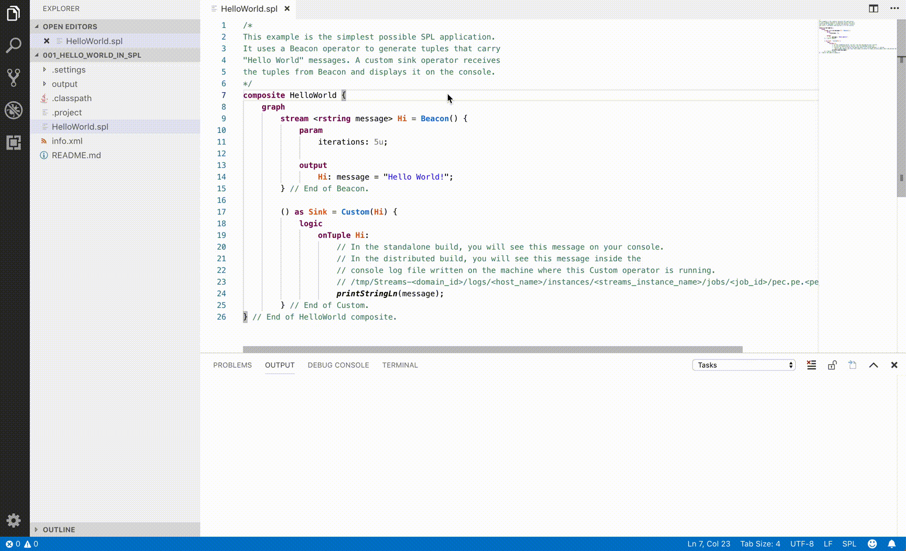
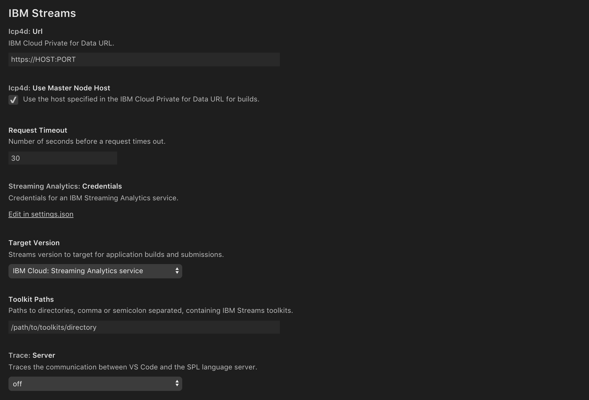

# IBM Streams Support for Visual Studio Code [Beta]

This extension provides support for Streams Processing Language (SPL), a distributed data flow composition language that is used in [IBM Streams](https://www.ibm.com/cloud/streaming-analytics). Powered by the [IBM Streams SPL language server](https://www.npmjs.com/package/@ibmstreams/spl-lsp).

Requires [Visual Studio Code 1.28.2](https://code.visualstudio.com/updates/v1_28) or later.

## Beta

This is the initial public release.

## Setup Instructions

To install the extension, search for __IBM Streams__ in the VS Code [Extension Marketplace](https://code.visualstudio.com/docs/editor/extension-gallery).

### Build

You may either build and run your Streams applications on an [IBM Cloud Streaming Analytics service](https://cloud.ibm.com/docs/services/StreamingAnalytics/index.html#gettingstarted) (V4.3) or an [IBM Cloud Private for Data (ICP4D) Streams add-on instance](https://www.ibm.com/support/knowledgecenter/SSQNUZ_current/com.ibm.icpdata.doc/streams/intro.html) (V5).

#### IBM Cloud: Streaming Analytics service

A running IBM Streaming Analytics service is required. You must provide your service credentials (in JSON format) in order for this extension to connect to your service. Execute the `Set IBM Streaming Analytics Service Credentials` command from the [Command Palette](https://code.visualstudio.com/docs/getstarted/userinterface) and enter your credentials.

If you need to create a service, start [here](https://cloud.ibm.com/catalog/services/streaming-analytics) and follow the instructions to create an account. Then, navigate to your [Dashboard](https://cloud.ibm.com/resources?groups=resource-instance) and select the Streaming Analytics service you want to use. Ensure that it is running and then create a new set of credentials. Select the __Service credentials__ tab on the left and click on the __New credential__ button. Once created, click on the __View credentials__ action and click on the __Copy__ button in the top-right corner of the credentials snippet to copy them to the clipboard.

#### IBM Cloud Private for Data: Streams add-on instance

A provisioned IBM Streams add-on is required. You must provide your IBM Cloud Private for Data URL in order for this extension to connect to your add-on instance. Execute the `Set IBM Cloud Private for Data URL` command from the [Command Palette](https://code.visualstudio.com/docs/getstarted/userinterface) and enter your URL.

If you need to provision an add-on, start [here](https://www.ibm.com/support/knowledgecenter/SSQNUZ_current/com.ibm.icpdata.doc/streams/intro.html) and follow the instructions.

### Toolkits

The IBM Streams product toolkits are bundled with this package. If your Streams applications use additional toolkits, you must copy them to a folder or multiple folders on your workstation. Note that each toolkit must contain a `toolkit.xml` file in order in order to be included. Then, execute the `Set IBM Streams Toolkits Path` command from the [Command Palette](https://code.visualstudio.com/docs/getstarted/userinterface) and enter the paths to your directories, comma or semicolon separated, containing the toolkits.

## Features

### Building and submitting SPL applications

### Color themes

Two [color themes](https://code.visualstudio.com/docs/getstarted/themes) are provided for SPL files: `Streams Light` and `Streams Dark`.

Note: To set a default color theme for `.spl` files to one of the included themes, you may want to search for a VS Code extension that provides that capability.

### Code assistance

This language extension supports typical code editing features including:

* Hover
* Reference Highlighting
* Diagnostics (syntax issues)
* [Code Completion](https://code.visualstudio.com/docs/editor/codebasics#_intellisense)
* [Go to Definition](https://code.visualstudio.com/docs/editor/editingevolved#_go-to-definition)
* [Peek Definition](https://code.visualstudio.com/docs/editor/editingevolved#_peek)
* [Find All References](https://code.visualstudio.com/docs/editor/editingevolved#_peek)
* [Rename Symbol](https://code.visualstudio.com/docs/editor/editingevolved#_rename-symbol)

## Commands

The following commands can be executed via context menus or the [Command Palette](https://code.visualstudio.com/docs/getstarted/userinterface#_command-palette).

### General Commands

Command | Title | Description
--- | --- | --
`ibm-streams.createApplication` | Create an IBM Streams Application from Template | Create a minimal application containing a source .spl file and an info.xml file.
`ibm-streams.openCloudDashboard` | Open IBM Cloud Dashboard | Open the IBM Cloud Dashboard in a web browser. Only available when `ibm-streams.targetVersion == IBM Cloud: Streaming Analytics service`.
`ibm-streams.openIcp4dDashboard` | Open IBM Cloud Private for Data Dashboard | Open the IBM Cloud Private for Data Dashboard in a web browser. Only available when `ibm-streams.targetVersion == IBM Cloud Private for Data: Streams add-on instance`.
`ibm-streams.openStreamingAnalyticsConsole` | Open IBM Streaming Analytics Console | Open the IBM Streaming Analytics Console in a web browser. Only available when `ibm-streams.targetVersion == IBM Cloud: Streaming Analytics service`.
`ibm-streams.openStreamsConsole` | Open IBM Streams Console | Open the IBM Streams Console in a web browser. Only available when `ibm-streams.targetVersion == IBM Cloud Private for Data: Streams add-on instance`.
`ibm-streams.refreshToolkits` | Refresh IBM Streams Toolkits | Pick up changes to the `ibm-streams.toolkitsPath` setting.
`ibm-streams.removeOutputChannels` | Remove Build Output Channels | Remove build output channels that are automatically created after executing build commands. These channels appear in the Output view.
`ibm-streams.setIcp4dUrl` | Set IBM Cloud Private for Data URL | Update the `ibm-streams.icp4dUrl` setting. Only available when `ibm-streams.targetVersion == IBM Cloud Private for Data: Streams add-on instance`.
`ibm-streams.setServiceCredentials` | Set IBM Streaming Analytics Service Credentials | Update the `ibm-streams.streamingAnalyticsCredentials` setting. Only available when `ibm-streams.targetVersion == IBM Cloud: Streaming Analytics service`.
`ibm-streams.setTargetVersion` | Set IBM Streams Target Version | Update the `ibm-streams.targetVersion` setting.
`ibm-streams.setToolkitsPath` | Set IBM Streams Toolkits Path | Update the `ibm-streams.toolkitsPath` setting.

### Build Commands

Command | Title | Description
--- | --- | --
`ibm-streams.buildAppDownload` | Build | Build an application from source and download the Streams application bundle (`.sab`) to the local file system in the project's `output/` directory. Only available for `.spl` files.
`ibm-streams.buildAppSubmit` | Build and Submit Job | Build an application from source and submit it to either an IBM Streaming Analytics service or IBM Cloud Private for Data Streams add-on instance. There are two submission options: (1) submit with the default configuration; (2) use the Streaming Analytics Console to customize the submission-time configuration. Only available for `.spl` files.
`ibm-streams.buildMakeDownload` | Build | Build application(s) defined in a Makefile and download the Streams application bundle(s) (`.sab`) to the local file system in the project's `output/` directory. Only available for `Makefile` files.
`ibm-streams.buildMakeSubmit` | Build and Submit Job(s) | Build application(s) defined in a Makefile and submit them to either an IBM Streaming Analytics service or IBM Cloud Private for Data Streams add-on instance. There are two submission options: (1) submit with the default configuration; (2) use the Streaming Analytics Console to customize the submission-time configuration. Only available for `Makefile` files.
`ibm-streams.submit` | Submit Job | Submit an application to either an IBM Streaming Analytics service or IBM Cloud Private for Data Streams add-on instance. There are two submission options: (1) submit with the default configuration; (2) use the Streaming Analytics Console to customize the submission-time configuration.. Only available for `.sab` files.

## Settings

The following [settings](https://code.visualstudio.com/docs/getstarted/settings) are supported:

Name | Description | Default
--- | --- | ---
`ibm-streams.icp4dUrl` | *(string)* Specifies the URL for an IBM Cloud Private for Data instance. | `https://HOST:PORT`
`ibm-streams.streamingAnalyticsCredentials` | *(object)* Specifies the credentials for an IBM Streaming Analytics service. | `null`
`ibm-streams.targetVersion` | *(string)* Specifies the Streams version to target for application builds and submissions. <ul><li>`IBM Cloud: Streaming Analytics service`</li><li>`IBM Cloud Private for Data: Streams add-on instance`</li></ul> | `IBM Cloud Private for Data: Streams add-on instance`
`ibm-streams.toolkitsPath` | *(string)* Specifies paths to directories, comma or semicolon separated, containing IBM Streams toolkits. | `/path/to/toolkits/directory`
`ibm-streams.useIcp4dMasterNodeHost` | *(boolean)* Specifies whether to use the host specified in the IBM Cloud Private for Data URL for builds. | `true`
`spl.trace.server` | *(string)* Traces the communication between VS Code and the SPL language server. <ul><li>`off`: tracing turned off</li><li>`verbose`: tracing turned on</li></ul> | `off`

