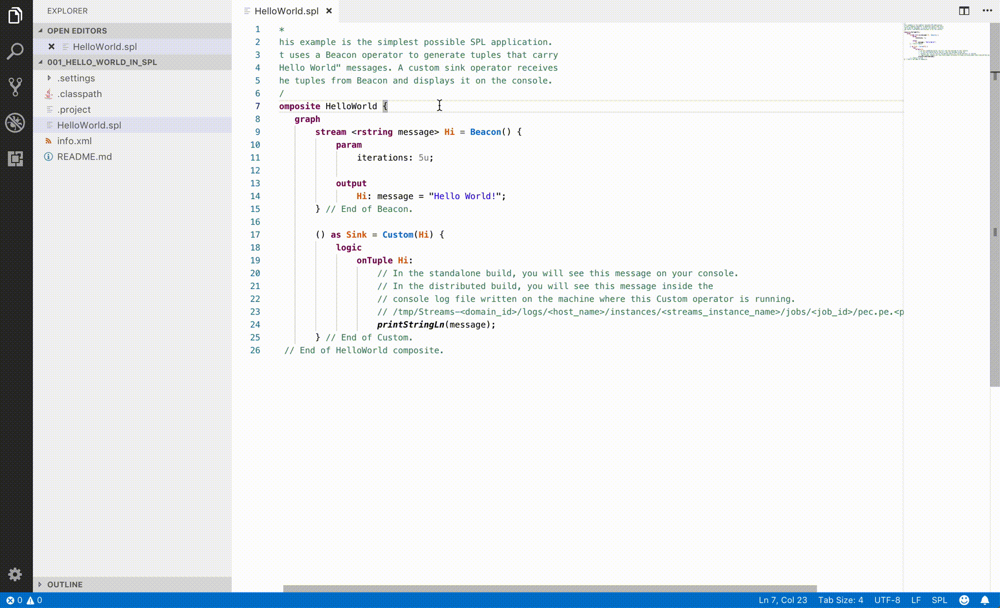

# IBM Streams Support for Visual Studio Code [Beta]

This extension provides support for Streams Processing Language (SPL), a distributed data flow composition language that is used in [IBM Streams](https://www.ibm.com/cloud/streaming-analytics). Powered by the [IBM Streams SPL language server](https://www.npmjs.com/package/@ibmstreams/spl-lsp).

Requires [Visual Studio Code 1.25.0](https://code.visualstudio.com/updates/v1_25) or later.

## Beta

This is the initial public release.

## Setup Instructions

To install the extension, search for __IBM Streams__ in the VS Code [Extension Marketplace](https://code.visualstudio.com/docs/editor/extension-gallery).

### Prerequisites

#### Build

An [IBM Streaming Analytics](https://console.bluemix.net/docs/services/StreamingAnalytics/index.html#gettingstarted) service is required to build and run your Streams applications. You must provide your service credentials (in JSON format) in order for this extension to connect to your service. Execute the `Set IBM Streaming Analytics Service Credentials` command from the [Command Palette](https://code.visualstudio.com/docs/getstarted/userinterface) and enter your credentials.

#### Toolkits

The IBM Streams product toolkits are bundled with this package. If your Streams applications use additional toolkits, you must copy them to a folder on your workstation. Note that each toolkit must contain a `toolkit.xml` file in order in order to be included. Then, execute the `Set IBM Streams Toolkits Path` command from the [Command Palette](https://code.visualstudio.com/docs/getstarted/userinterface) and enter your path.

## Functionality

### General

* `Streams Light` and `Streams Dark` color themes
  * *Note*: To set a default color theme for `.spl` files to one of the included themes, you may want to search for a VS Code extension that provides that capability.

### Code assistance

This language extension supports typical code editing features including:

* Hover
* Reference Highlighting
* Diagnostics (syntax issues)
* [Code Completion](https://code.visualstudio.com/docs/editor/codebasics#_intellisense)
* [Go to Definition](https://code.visualstudio.com/docs/editor/editingevolved#_go-to-definition)
* [Peek Definition](https://code.visualstudio.com/docs/editor/editingevolved#_peek)
* [Find All References](https://code.visualstudio.com/docs/editor/editingevolved#_peek)
* [Rename Symbol](https://code.visualstudio.com/docs/editor/editingevolved#_rename-symbol)

### Commands

The following commands can be executed via context menus or the [Command Palette](https://code.visualstudio.com/docs/getstarted/userinterface#_command-palette).

Command | Title | Visibility | Description
--- | --- | --- | ---
`ibm-streams.` `setServiceCredentials` | Set IBM Streaming Analytics Service Credentials | `*` | Sets the credentials for an IBM Streaming Analytics service. This is required to build applications.
`ibm-streams.` `setToolkitsPath` | Set IBM Streams Toolkits Path | `*` | Sets the path to a directory containing IBM Streams toolkits. This is required if your applications use toolkits that are not provided with the Streams product.
`ibm-streams.` `buildDownload` | Build | `*.spl` | Builds an application from source and downloads the Streams application bundle (`.sab`) to the local file system in the project's `output/` directory.
`ibm-streams.` `buildSubmit` | Build and Submit Job | `*.spl` | Builds an application from source and submits it to a [Streaming Analytics](https://console.bluemix.net/docs/services/StreamingAnalytics/index.html#gettingstarted) instance. There are two submission options: (1) submit with the default configuration; (2) use the Streaming Analytics Console to customize the submission-time configuration.
`ibm-streams.` `buildMakeDownload` | Build | `Makefile` | Builds applications defined in a Makefile and downloads the Streams application bundles (`.sab`) to the local file system in the project's `output/` directory.
`ibm-streams.` `buildMakeSubmit` | Build and Submit Job(s) | `Makefile` | Builds applications defined in a Makefile and submits them to a [Streaming Analytics](https://console.bluemix.net/docs/services/StreamingAnalytics/index.html#gettingstarted) instance. There are two submission options: (1) submit with the default configuration; (2) use the Streaming Analytics Console to customize the submission-time configuration.
`ibm-streams.` `submit` | Submit Job | `*.sab` | Submits an application to a [Streaming Analytics](https://console.bluemix.net/docs/services/StreamingAnalytics/index.html#gettingstarted) instance. There are two submission options: (1) submit with the default configuration; (2) use the Streaming Analytics Console to customize the submission-time configuration.
`ibm-streams.` `createApplication` | Create an IBM Streams Application from Template | `*` | Creates a minimal application containing a source `.spl` file and an [`info.xml`](https://www.ibm.com/support/knowledgecenter/SSCRJU_4.3.0/com.ibm.streams.dev.doc/doc/toolkitartifacts.html) file.
`ibm-streams.` `removeOutputChannels` | Remove Build Output Channels | `*` | Remove build output channels that are automatically created after executing build commands. These channels appear in the Output view.

### Settings

The following [settings](https://code.visualstudio.com/docs/getstarted/settings) are supported:

* `ibm-streams.toolkitsPath`: Path to a directory containing IBM Streams toolkits
* `ibm-streams.streamingAnalyticsCredentials`: Credentials for an IBM Streaming Analytics service
* `spl.trace.server`: Traces the communication between VS Code and the SPL language server.

## Known issues

Issue | Description | Workaround
--- | --- | ---
When loading the IBM Streaming Analytics Console, you see this error: `CWOAU0062E: The OAuth service provider could not redirect the request because the redirect URI was not valid. Contact your system administrator to resolve the problem.`  | This happens when you are not already logged into IBM Cloud. The IAM endpoints for authentication need to be updated and this work is in progress. | Log in to [IBM Cloud](https://console.bluemix.net) and then access the Console again.
