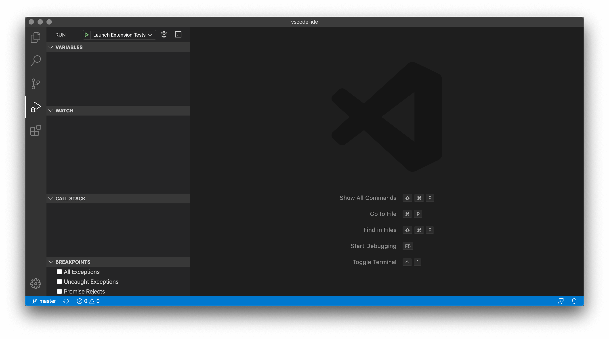

# Extension tests

You can either run the tests directly in VS Code or through the command line.

## Visual Studio Code

1.  Open the **Run** view by selecting the Run icon in the [Activity Bar](https://code.visualstudio.com/docs/getstarted/userinterface#_activity-bar) on the left side of VS Code
1.  Select the configuration named **Launch Extension Tests** using the Configuration dropdown
1.  Click on the green play button to start a debug session
1.  This will compile the extension source/test code and then launch a new VS Code window where the tests will run. The test results will be displayed in the **Debug Console** panel in the original window.



## Command Line

1.  Ensure that you do not have any VS Code instances open
1.  In a command line, run the following command in the root of this repository to launch the tests. This will compile the extension source/test code and then launch a new VS Code window where the tests will run. The test results will be displayed in the command line output.
    ```
    yarn run test
    ```